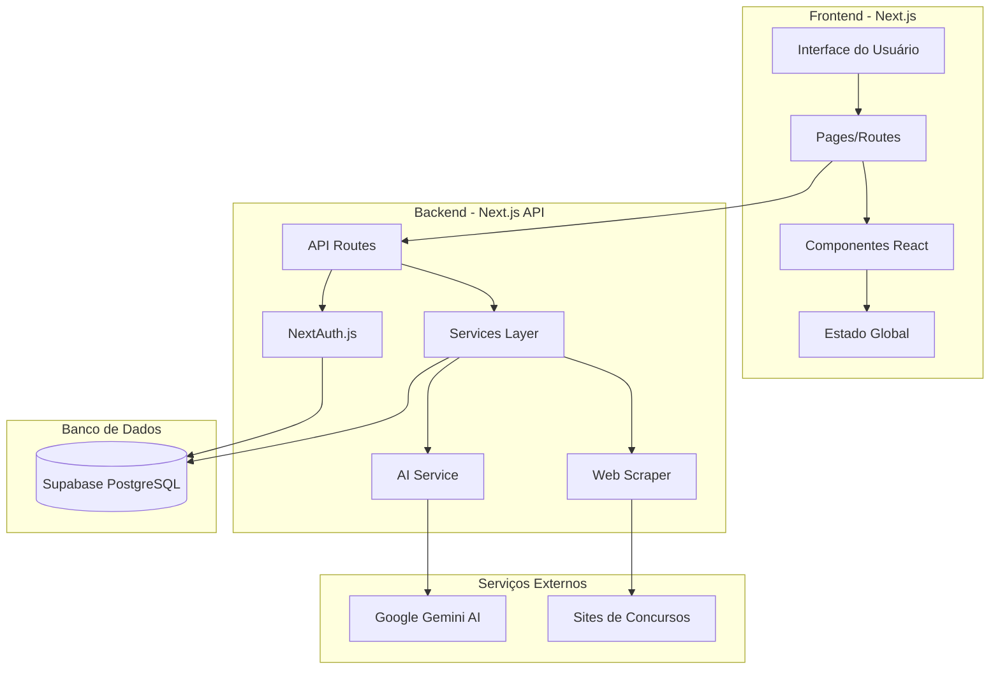
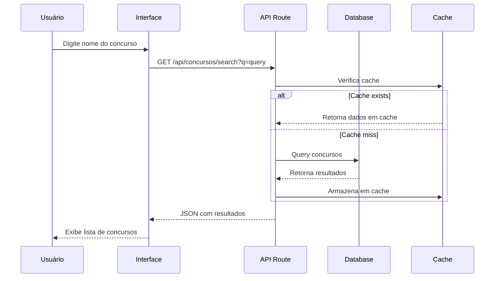
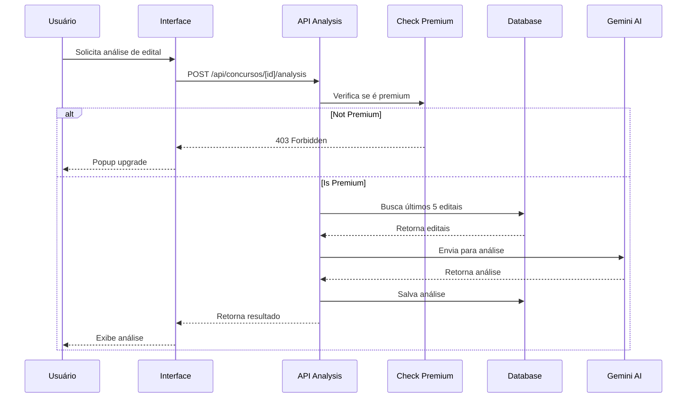
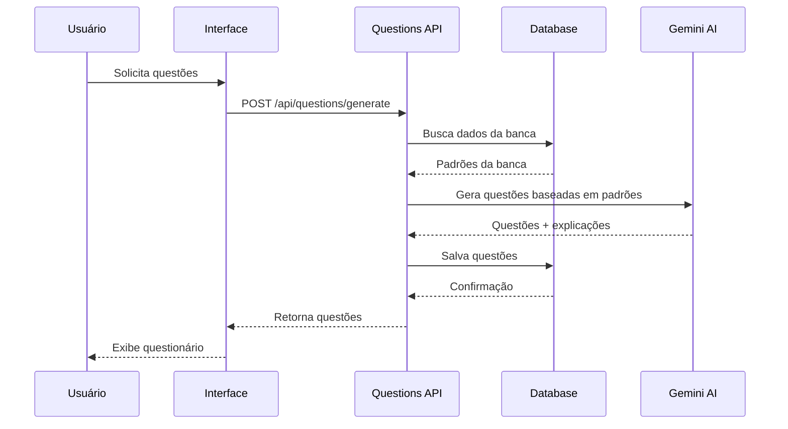
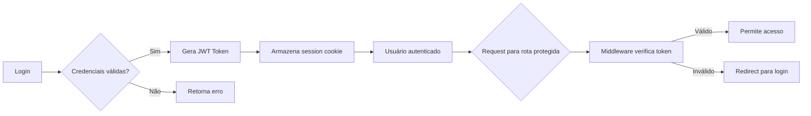
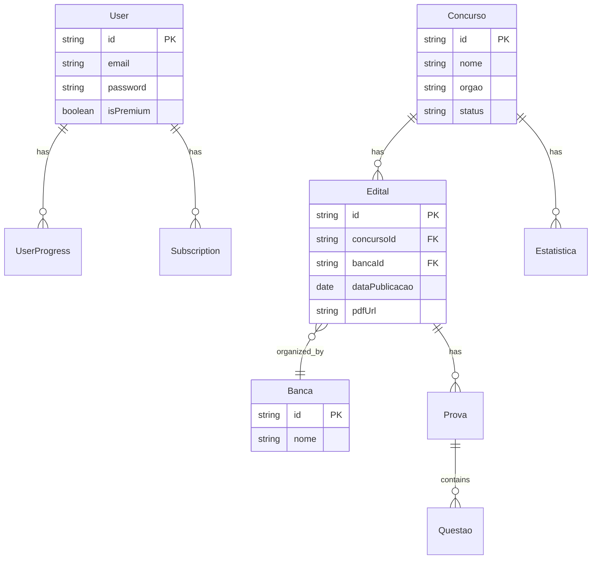
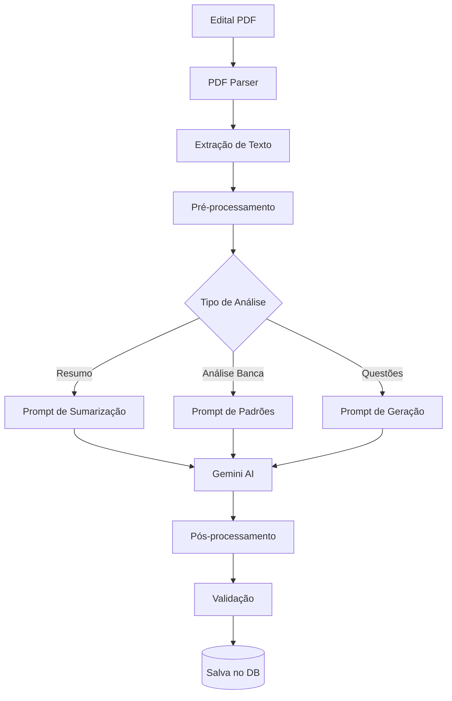
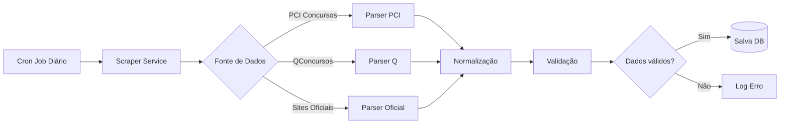
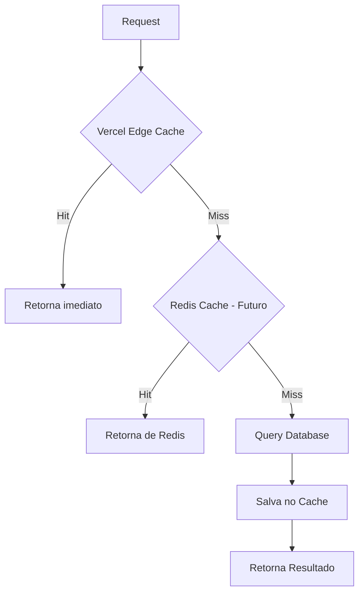
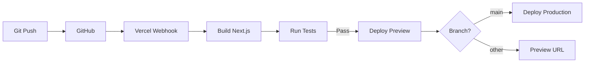

# 03 - Arquitetura do Sistema

## 🏗️ Visão Geral da Arquitetura

Este documento descreve a arquitetura técnica completa do App de Concursos Públicos, incluindo fluxo de dados, componentes principais e integrações.

---

## 📐 Diagrama de Arquitetura de Alto Nível



---

## 🎯 Arquitetura em Camadas

### Layer 1: Presentation (Frontend)
**Responsabilidade:** Interface do usuário e experiência

**Componentes:**
- **Pages:** Rotas e páginas (/, /login, /dashboard, etc.)
- **Components:** Componentes reutilizáveis
- **Hooks:** Lógica compartilhada
- **Styles:** TailwindCSS global

**Tecnologias:**
- Next.js 14 App Router
- React 18
- TailwindCSS

---

### Layer 2: Application (Business Logic)
**Responsabilidade:** Lógica de negócio e regras

**Componentes:**
- **API Routes:** Endpoints HTTP
- **Services:** Lógica de negócio
- **Validators:** Validação de dados
- **Middlewares:** Autenticação, logging

**Tecnologias:**
- Next.js API Routes
- NextAuth.js
- Zod (validação)

---

### Layer 3: Data Access
**Responsabilidade:** Acesso e persistência de dados

**Componentes:**
- **Prisma Client:** ORM para database
- **Repositories:** Padrão repository
- **Migrations:** Versionamento de schema
- **Seeders:** Dados iniciais

**Tecnologias:**
- Prisma ORM
- PostgreSQL (Supabase)

---

### Layer 4: External Services
**Responsabilidade:** Integrações externas

**Componentes:**
- **AI Service:** Google Gemini
- **Scraper Service:** Coleta de editais
- **Storage Service:** Upload de PDFs (Supabase Storage)

---

## 🔄 Fluxo de Dados Principal

### Fluxo 1: Busca de Concurso



---

### Fluxo 2: Análise de Edital com IA



---

### Fluxo 3: Geração de Questões



---

## 📁 Estrutura de Diretórios

```
app-concursos/
├── app/                          # Next.js App Router
│   ├── (auth)/                   # Grupo de autenticação
│   │   ├── login/
│   │   └── register/
│   ├── (dashboard)/              # Grupo autenticado
│   │   ├── layout.tsx
│   │   ├── page.tsx              # Dashboard home
│   │   ├── concurso/
│   │   │   └── [id]/
│   │   │       └── page.tsx      # Detalhes do concurso
│   │   └── practice/
│   │       └── [concursoId]/
│   │           └── page.tsx      # Prática de questões
│   ├── api/                      # API Routes
│   │   ├── auth/
│   │   │   └── [...nextauth]/
│   │   ├── concursos/
│   │   │   ├── search/
│   │   │   └── [id]/
│   │   │       ├── editais/
│   │   │       └── analysis/
│   │   └── questions/
│   │       └── generate/
│   ├── layout.tsx                # Root layout
│   ├── page.tsx                  # Landing page
│   └── globals.css               # Estilos globais
│
├── components/                   # Componentes React
│   ├── ui/                       # Componentes base
│   │   ├── button.tsx
│   │   ├── card.tsx
│   │   └── input.tsx
│   ├── auth/
│   │   └── login-form.tsx
│   ├── concurso/
│   │   ├── search-bar.tsx
│   │   ├── edital-card.tsx
│   │   └── banca-analysis.tsx
│   └── dashboard/
│       ├── stats-card.tsx
│       └── premium-gate.tsx
│
├── lib/                          # Bibliotecas e utilitários
│   ├── db/                       # Database
│   │   ├── prisma.ts
│   │   └── repositories/
│   ├── auth/                     # Autenticação
│   │   ├── config.ts
│   │   └── helpers.ts
│   ├── ai/                       # IA Services
│   │   ├── gemini-client.ts
│   │   ├── question-generator.ts
│   │   └── edital-analyzer.ts
│   ├── scrapers/                 # Web Scrapers
│   │   ├── edital-scraper.ts
│   │   └── prova-scraper.ts
│   ├── validators/               # Validações Zod
│   │   └── schemas.ts
│   └── utils/                    # Utilitários
│       ├── format.ts
│       └── constants.ts
│
├── prisma/                       # Prisma ORM
│   ├── schema.prisma
│   ├── migrations/
│   └── seed.ts
│
├── public/                       # Arquivos estáticos
│   ├── images/
│   └── fonts/
│
├── documentacao-relatorios/      # Documentação
│   ├── README.md
│   ├── 01-visao-geral-projeto.md
│   └── ...
│
├── .env.local                    # Variáveis de ambiente (gitignored)
├── .env.example                  # Template de env vars
├── next.config.js                # Configuração Next.js
├── tailwind.config.ts            # Configuração Tailwind
├── tsconfig.json                 # Configuração TypeScript
└── package.json                  # Dependências
```

---

## 🔐 Arquitetura de Autenticação

### NextAuth.js Session Flow



### Protected Routes
- **Middleware:** Verifica session antes de permitir acesso
- **Server Components:** getServerSession() para validação
- **Client Components:** useSession() hook

---

## 🗄️ Modelo de Dados (Simplificado)



---

## 🤖 Arquitetura de IA

### Pipeline de Processamento



### Estratégias de Otimização

1. **Cache Agressivo:**
   - Análises ficam em cache por 30 dias
   - Questões geradas são reutilizadas

2. **Rate Limiting:**
   - Máximo 10 análises/hora por usuário gratuito
   - Ilimitado para premium

3. **Queue System:**
   - Requisições pesadas vão para fila
   - Processamento assíncrono em background

---

## 🌐 Arquitetura de Scraping

### Fluxo de Coleta de Dados



### Estratégia de Scraping

- **Frequência:** Cron job diário (Vercel Cron)
- **Rate Limiting:** Respeitar robots.txt e delays
- **Fallback:** Múltiplas fontes para mesmos dados
- **Validação:** Schema validation com Zod

---

## 📊 Arquitetura de Cache

### Estratégia Multi-Layer



**Camadas:**
1. **Vercel Edge Cache:** Páginas estáticas (60s)
2. **Next.js Cache:** Dados de API (stale-while-revalidate)
3. **Banco de Dados:** Dados persistidos

**TTL (Time to Live):**
- Concursos: 1 hora
- Editais: 24 horas
- Análises de IA: 30 dias
- Questões: Permanente

---

## 🔄 Deploy e CI/CD

### Pipeline de Deploy



**Ambientes:**
- **Development:** Local (npm run dev)
- **Preview:** Branch deployments automáticos
- **Production:** Branch main

---

## 🔒 Segurança

### Camadas de Segurança

1. **Autenticação:**
   - Passwords hasheados (bcrypt)
   - JWT tokens assinados
   - CSRF protection (NextAuth)

2. **Autorização:**
   - Role-based access (free/premium)
   - Middleware protection
   - API rate limiting

3. **Dados:**
   - HTTPS obrigatório (Vercel)
   - Environment variables secretas
   - SQL injection prevention (Prisma)

4. **Frontend:**
   - XSS protection (React auto-escape)
   - Content Security Policy
   - Sanitização de inputs

---

## 📈 Escalabilidade

### Estratégias Futuras

**Horizontal Scaling:**
- Serverless functions (auto-scale)
- CDN para assets estáticos
- Database read replicas (quando necessário)

**Vertical Scaling:**
- Upgrade de tiers quando limites atingidos
- Otimização de queries
- Implementação de indexes

**Monitoramento:**
- Vercel Analytics para performance
- Logs estruturados
- Error tracking (Sentry - futuro)

---

**Documento criado em:** 09/01/2026  
**Versão:** 1.0  
**Última revisão:** 09/01/2026
